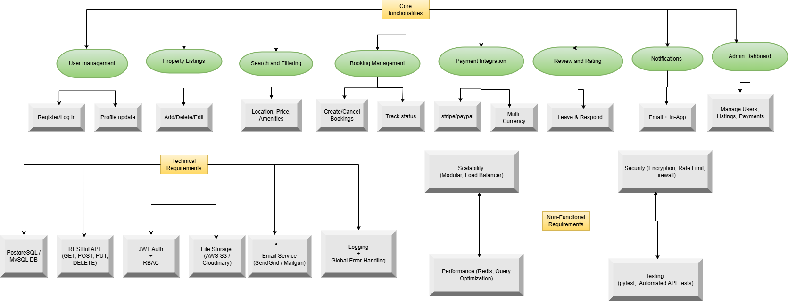

# 🏡 Airbnb Clone - Backend

This project is a backend system for an Airbnb Clone, designed to replicate the key functionalities of a rental marketplace. The application supports core user flows such as property listing, booking management, user authentication, secure payment integration, and more.

---

## 🔑 Core Functionalities

### 1. User Management

- **User Registration**
  - Sign up as guest or host
  - Secure authentication using JWT

- **User Login and Authentication**
  - Login via email and password
  - OAuth (Google, Facebook) support

- **Profile Management**
  - Update profile information
  - Upload profile photo
  - Configure personal preferences

### 2. Property Listings Management

- **Add Listings**
  - Hosts provide title, description, location, price, amenities, availability

- **Edit/Delete Listings**
  - Hosts can update or remove their listings

### 3. Search and Filtering

- Search by:
  - Location
  - Price range
  - Number of guests
  - Amenities (Wi-Fi, pool, pet-friendly)

- Pagination support for large datasets

### 4. Booking Management

- **Booking Creation**
  - Guests can book listings for selected dates
  - Prevent double bookings

- **Booking Cancellation**
  - Guests and hosts can cancel bookings as per policy

- **Booking Status Tracking**
  - Status: pending, confirmed, canceled, completed

### 5. Payment Integration

- Secure gateways: Stripe / PayPal
- Upfront guest payments
- Automatic host payouts
- Multi-currency support

### 6. Reviews and Ratings

- Guests can leave reviews and ratings
- Hosts can respond to reviews
- Reviews linked to verified bookings

### 7. Notification System

- **Email and In-App Notifications**
  - Booking confirmation
  - Cancellation alerts
  - Payment updates

### 8. Admin Dashboard

- Admin access to manage:
  - Users
  - Listings
  - Bookings
  - Payments

---

## 🛠️ Technical Requirements

### 1. Database Management

- **Database**: PostgreSQL / MySQL
- **Tables**:
  - Users
  - Properties
  - Bookings
  - Reviews
  - Payments

### 2. API Development

- RESTful API
  - `GET`, `POST`, `PUT`, `DELETE`
  - Proper HTTP status codes

- Optional: GraphQL for advanced querying

### 3. Authentication & Authorization

- JWT-based authentication
- RBAC (Role-Based Access Control):
  - Guests
  - Hosts
  - Admins

### 4. File Storage

- Store images with:
  - AWS S3
  - Cloudinary (default for implementation)

### 5. Third-Party Services

- Email: SendGrid / Mailgun

### 6. Error Handling and Logging

- Global API error handling
- Logging and monitoring for issues

---

## 🚀 Non-Functional Requirements

### 1. Scalability

- Modular architecture
- Load balancers for horizontal scaling

### 2. Security

- Data encryption
- Rate limiting
- Firewall protection

### 3. Performance Optimization

- Redis caching
- Optimized database queries

### 4. Testing

- Unit and integration tests with **pytest**
- Automated API endpoint testing

---

## 🧭 Feature Map Diagram

Below is a visual representation of the system’s main features and structure:

---